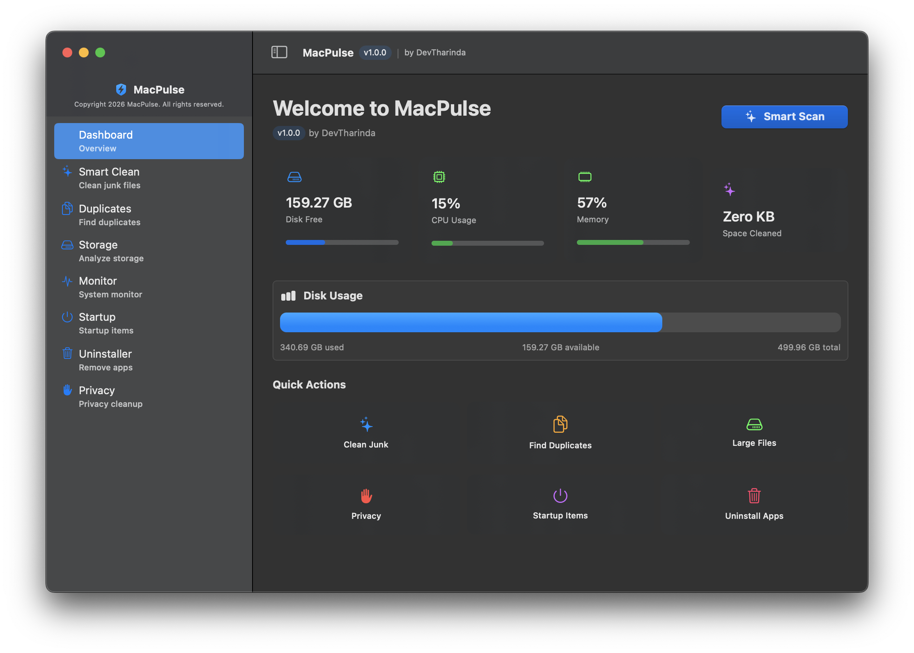
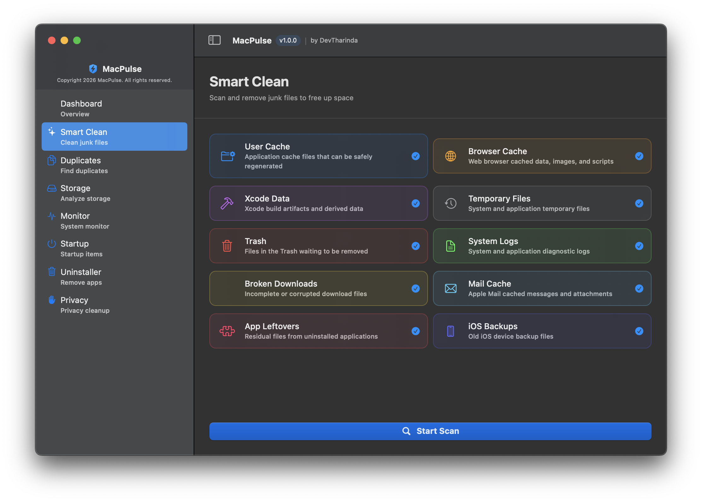
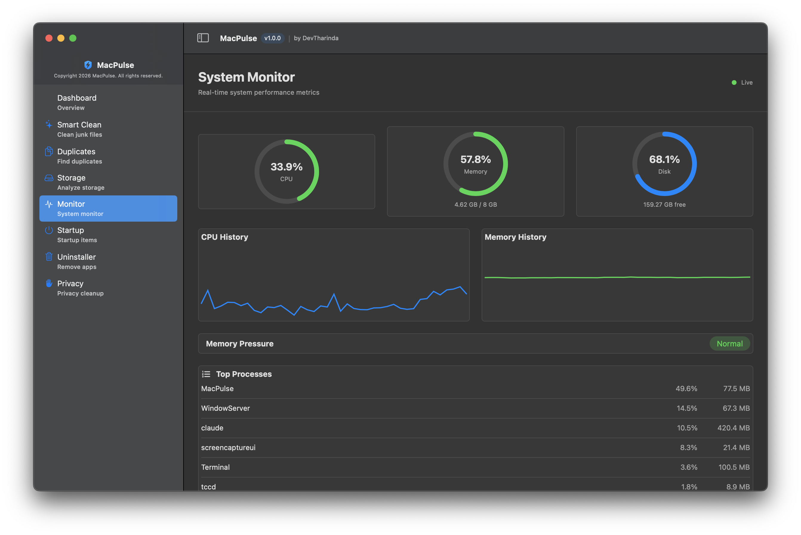

<div align="center">


# MacPulse

### Professional macOS System Optimizer

[](https://app.circleci.com/pipelines/circleci/Ck1axcVK9MgG2Cxwm68c/5MNV9uX6gJpRGWHrFBi6bT)


**Clean. Optimize. Protect.** A production-grade macOS optimization suite that keeps your Mac running at peak performance.

[**Download v1.0.0**](https://github.com/mr-kumuditha/MacPulse/releases/download/v1.0.0/MacPulse-v1.0.0.dmg) | [**View Release**](https://github.com/mr-kumuditha/MacPulse/releases/tag/v1.0.0) | [**Report Issue**](https://github.com/mr-kumuditha/MacPulse/issues)

---

</div>

## Screenshots

<div align="center">

### Dashboard


<br/>

### Smart Clean


<br/>

### System Monitor


</div>

---

## Features

<table>
<tr>
<td width="50%">

### Smart Clean
- User & browser cache cleanup
- Xcode DerivedData removal
- Temporary files & system logs
- Trash, broken downloads
- Mail cache & app leftovers
- iOS backup management

</td>
<td width="50%">

### Duplicate Finder
- SHA-256 hash-based detection
- Smart auto-select (keeps originals)
- Batch delete with size preview
- Wasted space calculator

</td>
</tr>
<tr>
<td width="50%">

### Real-time System Monitor
- Live CPU, RAM, disk gauges
- Memory pressure analysis
- CPU & memory history charts
- Top processes by resource usage

</td>
<td width="50%">

### Storage Analyzer
- Visual disk usage breakdown
- Large file scanner (configurable threshold)
- Sort by size, date, or name
- Reveal in Finder integration

</td>
</tr>
<tr>
<td width="50%">

### Privacy Cleaner
- Safari, Chrome, Firefox, Brave
- Browsing history & cookies
- Cache & session data
- Selective cleaning per browser

</td>
<td width="50%">

### App Uninstaller
- Complete app removal
- Detects preferences, caches, containers
- Leftover file scanner
- App size analysis

</td>
</tr>
<tr>
<td width="50%">

### Startup Manager
- LaunchAgents & LaunchDaemons
- Enable/disable with one toggle
- Filter by type
- Protected system service detection

</td>
<td width="50%">

### Automation Engine
- Scheduled cleaning (daily/weekly/monthly)
- Smart notifications
- Configurable categories per schedule
- Background operation

</td>
</tr>
</table>

---

## Installation

### Quick Install

1. **[Download MacPulse-v1.0.0.dmg](https://github.com/mr-kumuditha/MacPulse/releases/download/v1.0.0/MacPulse-v1.0.0.dmg)** (3.3 MB)
2. Open the DMG file
3. Drag **MacPulse** to **Applications**
4. First launch: Right-click > **Open** (to bypass Gatekeeper)

### System Requirements

| Requirement | Minimum |
|---|---|
| **macOS** | 13.0 (Ventura) or later |
| **Processor** | Intel x86_64 |
| **Disk Space** | 50 MB |
| **RAM** | 4 GB recommended |

---

## Architecture

Built with enterprise-grade architecture following Apple's best practices.

```
MacPulse/
├── App/                          # Entry point, AppDelegate, AppState
├── Models/                       # 9 data models
│   ├── ScanResult                # Scan results & categories
│   ├── SystemMetrics             # CPU, RAM, disk metrics
│   ├── DuplicateFile             # Duplicate detection models
│   └── ...
├── ViewModels/                   # 7 MVVM view models
├── Views/                        # 11 SwiftUI views
│   ├── Dashboard/                # Main overview
│   ├── Scanner/                  # Smart clean interface
│   ├── Monitor/                  # Real-time system monitor
│   ├── Premium/                  # Subscription UI
│   └── ...
├── Services/                     # 11 backend services
│   ├── ScanEngine (Actor)        # Async file scanning
│   ├── SystemMonitor             # Mach kernel APIs
│   ├── SafetyManager             # File protection layer
│   ├── DuplicateFinderService    # SHA-256 hashing
│   ├── LicenseManager            # StoreKit 2
│   └── ...
└── Utilities/
    ├── Logger                    # os.log unified logging
    └── AppInfo                   # Version & branding
```

### Tech Stack

| Component | Technology |
|---|---|
| **Language** | Swift 5.9 |
| **UI Framework** | SwiftUI + AppKit |
| **Architecture** | MVVM |
| **Concurrency** | Swift Actors, async/await |
| **Reactive** | Combine |
| **Monitoring** | Mach kernel APIs, sysctl |
| **Hashing** | CommonCrypto (SHA-256) |
| **Payments** | StoreKit 2 |
| **Logging** | os.log (unified logging) |

### Design Patterns
- **MVVM** with `@StateObject` / `@ObservedObject`
- **Swift Actors** for thread-safe services (7 actors)
- **Combine** for reactive data flow
- **async/await** throughout (38+ async functions)
- **Dependency injection** via SwiftUI environment objects

---

## CI/CD Pipeline

Automated testing via **CircleCI** on every push to `main`.

<div align="center">

</div>

### Pipeline Jobs

| Job | Description | Status |
|---|---|---|
| **validate-structure** | Verifies 18 directories + 44 required files | Passing |
| **syntax-check** | Balanced braces, imports, entry point validation | Passing |
| **architecture-check** | MVVM layers, actors, async/await, reactive patterns | Passing |
| **security-check** | SafetyManager protections, no hardcoded secrets | Passing |
| **feature-check** | All 10 core features present and accounted for | Passing |

---

## Security

MacPulse implements a multi-layer safety system to protect your Mac:

| Protection | Description |
|---|---|
| **Protected Paths** | System files, keychains, SSH keys, user documents — never deleted |
| **Protected Extensions** | `.keychain`, `.pem`, `.key`, `.cert`, `.p12` files blocked |
| **Running App Detection** | Cannot delete bundles of currently running applications |
| **System Service Guard** | Critical macOS daemons (Finder, Dock, loginwindow) protected |
| **Deletion Audit Log** | Every file operation logged with timestamps and sizes |
| **Batch Validation** | Each file individually verified through SafetyManager before removal |

---

## Building from Source

```bash
# Clone the repository
git clone https://github.com/mr-kumuditha/MacPulse.git
cd MacPulse

# Build (requires Xcode Command Line Tools)
SDK=$(xcrun --sdk macosx --show-sdk-path)
xcrun swiftc -sdk "$SDK" -target x86_64-apple-macos13.0 -O -parse-as-library \
  -framework SwiftUI -framework AppKit -framework Combine \
  -framework StoreKit -framework IOKit \
  $(find MacPulse -name "*.swift" -type f -print0 | xargs -0 echo) \
  -o MacPulse.bin

# Run local validation (no Xcode needed)
bash validate.sh
```

---

## Project Stats

| Metric | Value |
|---|---|
| **Swift Files** | 44 |
| **Lines of Code** | 5,200+ |
| **Models** | 9 |
| **Views** | 11 |
| **ViewModels** | 7 |
| **Services** | 11 |
| **Unit Tests** | 19 |
| **Actors** | 7 |
| **@Published Properties** | 58 |
| **Async Functions** | 38+ |

---

## Monetization

| Tier | Price | Features |
|---|---|---|
| **Free** | $0 | Smart Clean, Basic Monitoring |
| **Trial** | 7 days free | All Pro features |
| **Pro Monthly** | $4.99/mo | Everything |
| **Pro Yearly** | $29.99/yr | Everything (save 50%) |

Powered by **StoreKit 2** with receipt validation and entitlement management.

---

## Roadmap

- [ ] Apple Silicon (ARM64) native build
- [ ] Network traffic monitoring
- [ ] Temperature sensor integration (SMC)
- [ ] App Store submission
- [ ] Sparkle auto-update framework
- [ ] Localization (multi-language support)

---

<div align="center">

## Developed by DevTharinda

**MacPulse** — Keeping your Mac at peak performance.

[](https://github.com/mr-kumuditha)

Copyright 2026 MacPulse. All rights reserved.

[**Download MacPulse v1.0.0**](https://github.com/mr-kumuditha/MacPulse/releases/download/v1.0.0/MacPulse-v1.0.0.dmg)

</div>
